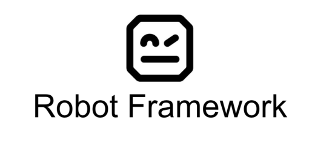

<h1 align="center">Robot Framework e Browser Library</h1>

<h1 align="center">
  
</h1>

<h2 align="center">
    Projeto para estudo de automação de testes com Robot framework
</h2>
<h3 align="center">
    <a href="https://robotframework.org/"> Robot Framework</a>
</h3>

<h3 align="center">
    O projeto tem como base a utilização da lib Browser Library (playwright)
</h3>
<h3 align="center">
    <a href="https://robotframework-browser.org/"> Browser Library</a>
</h3>

<h3 align="center">
    Todo projeto está sendo apresentado em nosso Newsletter no linkedin
</h3>
<h3 align="center">
    <a href="https://www.linkedin.com/newsletters/testes-e-robot-framework-7089354508467642369/">Testes e Robot Framework</a>
</h3>

🤖 Automação de testes com Robot Framework

